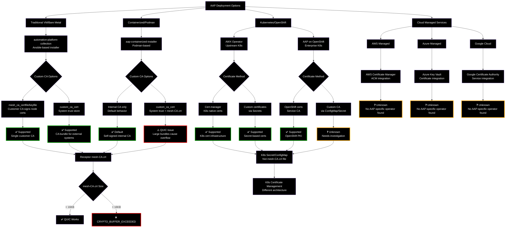

# AAP Deployment Types and Custom CA Support

## Overview of AAP Deployment Methods and Certificate Handling

## Deployment Type Analysis

### ✅ Traditional VM/Bare Metal (automation-platform-collection)

**Installer:** Ansible-based automation-platform-collection
**Receptor Config:** File-based `/etc/receptor/tls/ca/mesh-CA.crt`

**Custom CA Support:**
1. **mesh_ca_certfile/mesh_ca_keyfile:**
   - Customer provides CA certificate and private key
   - Installer uses it to sign all Receptor node certificates
   - Result: mesh-CA.crt contains customer's single CA
   - **Use case:** Enterprise security requirements for signed certificates

2. **custom_ca_cert:**
   - Customer provides CA bundle for system trust
   - Installed in `/etc/pki/ca-trust/source/anchors/`
   - **Problem:** Currently also concatenated into mesh-CA.crt (causes QUIC overflow)
   - **Use case:** External PostgreSQL cert auth, system integrations

**Code Reference:** `automation-platform-collection/roles/receptor/tasks/tls_ca.yml`

### ✅ Containerized/Podman (aap-containerized-installer)

**Installer:** Podman-based containerized deployment
**Receptor Config:** Mounted into containers

**Custom CA Support:**
1. **Internal CA (default):**
   - Installer generates self-signed CA
   - Signs all component certificates
   - Result: Minimal mesh-CA.crt (~1,500 bytes)

2. **custom_ca_cert:**
   - Installed in system trust store
   - **Currently concatenated into mesh-CA.crt** ← QUIC PROBLEM
   - Large bundles (154+ certs) cause buffer overflow

**Code Reference:** `aap-containerized-installer/roles/receptor/templates/mesh-CA.crt.j2`

### ✅ Kubernetes/OpenShift (AWX Operator)

**Installer:** Operator-based deployment
**Receptor Config:** ConfigMaps/Secrets in K8s

**Custom CA Support:**
1. **Cert-manager integration:**
   - Kubernetes-native certificate management
   - Automated certificate lifecycle
   - Different architecture than file-based

2. **Custom certificates via Secrets:**
   - Customer provides certificates as K8s Secrets
   - Mounted into pods
   - No file-based mesh-CA.crt

**Note:** AWX operator is upstream project. AAP on OpenShift deployment specifics need further investigation.

**Code Reference:** [ansible/awx-operator](https://github.com/ansible/awx-operator)

### ❓ Cloud Managed Services (AWS/Azure/GCP)

**Status:** No AAP-specific operators found in analyzed repositories

**Likely Scenarios:**
- AAP deployed via marketplace offerings
- Uses cloud provider certificate management (ACM, Key Vault, CA Service)
- May use containerized or VM-based installers with cloud integration
- Custom CA handling depends on underlying deployment method

**Needs Investigation:** 
- AWS Marketplace AAP offering
- Azure Marketplace AAP offering  
- Google Cloud Marketplace AAP offering

## Key Findings

### Common Pattern:
**All deployment methods that use file-based Receptor configuration** (VM, containerized) reference `mesh-CA.crt` and can encounter the QUIC buffer overflow issue with large CA bundles.

### Kubernetes Exception:
**Operator-based deployments** use different certificate architecture (Secrets/ConfigMaps) and may not have the same mesh-CA.crt file-based approach.

### The Problem Scope:
**QUIC buffer overflow primarily affects:**
- ✅ Traditional VM installations using custom_ca_cert
- ✅ Containerized installations using custom_ca_cert
- ❓ OpenShift deployments (needs investigation)
- ❓ Cloud marketplace offerings (needs investigation)

### The Solution:
**Installer fix applies to:**
- automation-platform-collection (VM installer)
- aap-containerized-installer (Podman installer)

**May not apply to:**
- Kubernetes operator deployments (different architecture)
- Cloud-managed offerings (vendor-specific)
