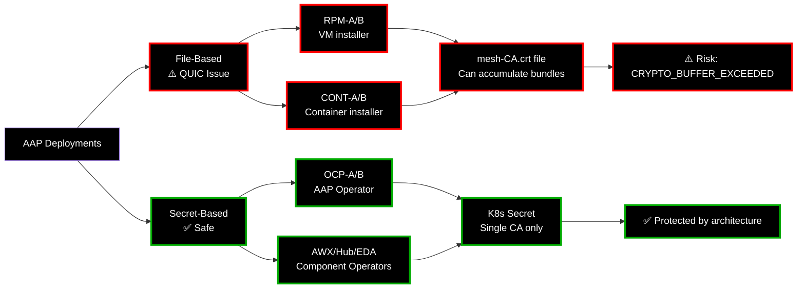
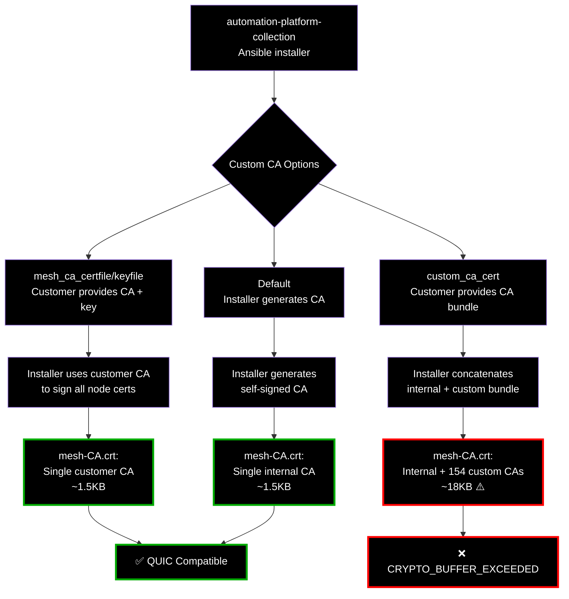
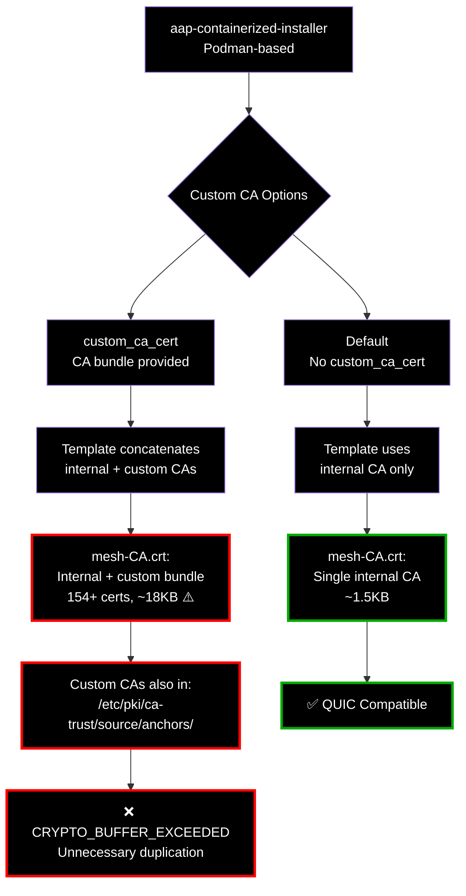
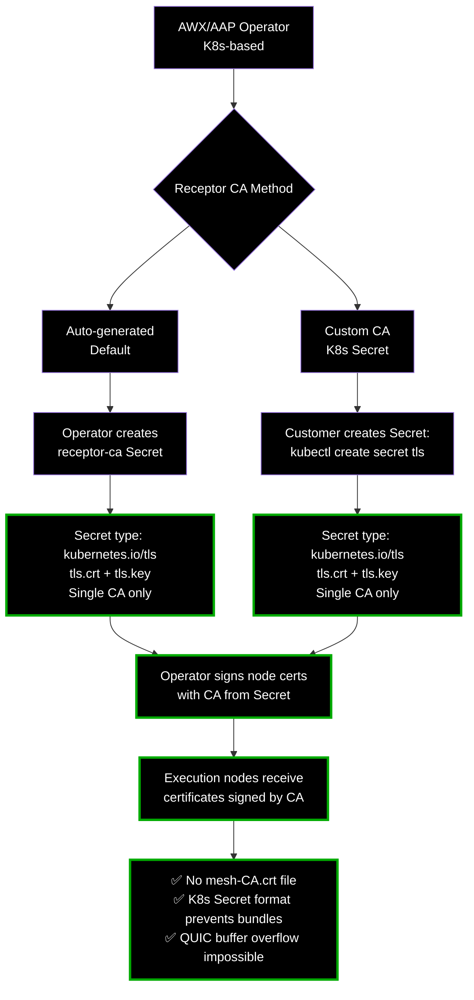

# AAP Deployment Types and Custom CA Support

## Quick Overview

## Deployment Type Comparison and Scope

| Deployment | Installer | CA Format | Custom CA | QUIC Risk | Fix Needed |
|-----------|-----------|-----------|-----------|-----------|------------|
| **RPM-A** (Standard VM) | automation-platform-collection | File | mesh_ca_certfile, custom_ca_cert bundle | ⚠️ YES | ✅ YES |
| **RPM-B** (Enterprise VM) | automation-platform-collection | File | mesh_ca_certfile, custom_ca_cert bundle | ⚠️ YES | ✅ YES |
| **CONT-A** (Standard Container) | aap-containerized-installer | File | custom_ca_cert bundle | ⚠️ YES | ✅ YES |
| **CONT-B** (Enterprise Container) | aap-containerized-installer | File | custom_ca_cert bundle | ⚠️ YES | ✅ YES |
| **OCP-A** (Standard OpenShift) | AAP Operator | K8s Secret | Single CA Secret | ✅ NO | ❌ NO |
| **OCP-B** (Enterprise OpenShift/SaaS) | AAP Operator | K8s Secret | Single CA Secret | ✅ NO | ❌ NO |
| **AWX Operator** (Kubernetes) | AWX Operator | K8s Secret | Single CA Secret | ✅ NO | ❌ NO |

## Repository and Code References

| Deployment | Component | Repository | Code Links |
|-----------|-----------|-----------|------------|
| **RPM-A/B** | VM Installer | [automation-platform-collection](https://github.com/ansible/automation-platform-collection) | [tls_ca.yml](https://github.com/ansible/automation-platform-collection/blob/main/roles/receptor/tasks/tls_ca.yml), [receptor.conf.j2](https://github.com/ansible/automation-platform-collection/blob/main/roles/receptor/templates/receptor.conf.j2) |
| **CONT-A/B** | Container Installer | [aap-containerized-installer](https://github.com/ansible/aap-containerized-installer) | [mesh-CA.crt.j2](https://github.com/ansible/aap-containerized-installer/blob/main/roles/receptor/templates/mesh-CA.crt.j2), [tls.yml:78-94](https://github.com/ansible/aap-containerized-installer/blob/main/roles/receptor/tasks/tls.yml#L78-L94) |
| **OCP-A/B** | AAP Operator | Operator Hub subscription | OpenShift Operator Marketplace |
| **AWX Operator** | K8s Operator | [awx-operator](https://github.com/ansible/awx-operator) | [custom-receptor-certs.md](https://github.com/ansible/awx-operator/blob/devel/docs/user-guide/advanced-configuration/custom-receptor-certs.md), [receptor_ca_secret.yaml.j2](https://github.com/ansible/awx-operator/blob/devel/roles/installer/templates/secrets/receptor_ca_secret.yaml.j2) |
| **All** | Core Receptor | [receptor](https://github.com/ansible/receptor) | [netceptor.go:1105-1107](https://github.com/ansible/receptor/blob/devel/pkg/netceptor/netceptor.go#L1105-L1107) |
| **All** | AWX Controller | [awx](https://github.com/ansible/awx) | [receptor.py:785-792](https://github.com/ansible/awx/blob/devel/awx/main/tasks/receptor.py#L785-L792) |

---

## Detailed Architecture Diagrams

### Traditional VM/Bare Metal (RPM-A/B)

### Containerized/Podman (CONT-A/B)

### Kubernetes/OpenShift Operators (OCP-A/B)

---

## Deployment Type Details and Code References

| Deployment | Repository | CA Storage | Custom CA | Problem | Code Links |
|-----------|-----------|-----------|-----------|---------|------------|
| **RPM-A/B** (VM) | [automation-platform-collection](https://github.com/ansible/automation-platform-collection) | File: `mesh-CA.crt` | `mesh_ca_certfile` `custom_ca_cert` | custom_ca_cert bundles concatenated (154+ certs) | [tls_ca.yml](https://github.com/ansible/automation-platform-collection/blob/main/roles/receptor/tasks/tls_ca.yml) [receptor.conf.j2](https://github.com/ansible/automation-platform-collection/blob/main/roles/receptor/templates/receptor.conf.j2) |
| **CONT-A/B** (Container) | [aap-containerized-installer](https://github.com/ansible/aap-containerized-installer) | File: `mesh-CA.crt` | `custom_ca_cert` | custom_ca_cert bundles concatenated (154+ certs) | [mesh-CA.crt.j2](https://github.com/ansible/aap-containerized-installer/blob/main/roles/receptor/templates/mesh-CA.crt.j2) [tls.yml:78-94](https://github.com/ansible/aap-containerized-installer/blob/main/roles/receptor/tasks/tls.yml#L78-L94) |
| **OCP-A/B** (OpenShift) | AAP Operator | Secret: `receptor-ca` | K8s TLS Secret | None - Secret prevents bundles | Operator Hub |
| **AWX Operator** (K8s) | [awx-operator](https://github.com/ansible/awx-operator) | Secret: `receptor-ca` | K8s TLS Secret | None - Secret prevents bundles | [custom-receptor-certs.md](https://github.com/ansible/awx-operator/blob/devel/docs/user-guide/advanced-configuration/custom-receptor-certs.md) [receptor_ca_secret.yaml.j2](https://github.com/ansible/awx-operator/blob/devel/roles/installer/templates/secrets/receptor_ca_secret.yaml.j2) |
| **Core Receptor** | [receptor](https://github.com/ansible/receptor) | N/A | N/A | ReceptorVerifyFunc duplication | [netceptor.go:1105-1107](https://github.com/ansible/receptor/blob/devel/pkg/netceptor/netceptor.go#L1105-L1107) |

## Findings

### Summary:

**File-Based Deployments (Affected):**
- RPM-A/B, CONT-A/B use file-based mesh-CA.crt
- custom_ca_cert bundles concatenated into file
- Large files (154+ certs, 18KB+) exceed QUIC 16KB limit

**Secret-Based Deployments (Safe):**
- OCP-A/B, AWX/Hub/EDA operators use K8s Secrets
- Secret format stores single cert/key pair only
- Cannot accumulate large CA bundles architecturally

### Solution:

**Installer fix (file-based deployments):**
- **Target:** automation-platform-collection, aap-containerized-installer
- **Change:** Remove custom_ca_cert concatenation from mesh-CA.crt.j2
- **Scope:** RPM and containerized installation methods only

**Operator deployments (no fix needed):**
- **Already protected** by K8s Secret architecture
- **Cannot accumulate** large CA bundles
- **No code changes** required
