# QUIC Buffer Overflow: Installation vs Receptor Function Fixes

## Problem Flow and Solution Approaches

```mermaid
graph TD
    A[Customer Installs AAP] --> B{Uses custom_ca_cert?}
    B -->|Yes| C[Installer Template<br/>mesh-CA.crt.j2]
    B -->|No| D[Only Internal CA<br/>~1 certificate]
    
    C --> E[Current: Simple Concatenation<br/>Internal CA + Custom CA Bundle<br/>No Deduplication]
    E --> F[Large mesh-CA.crt<br/>154+ certificates<br/>~18,342 bytes<br/>May contain duplicates]
    
    D --> G[Small mesh-CA.crt<br/>1 certificate<br/>~1,500 bytes]
    
    F --> H[Receptor Starts]
    G --> H
    
    H --> I[QUIC Connection Attempt]
    I --> J[Peer Sends Certificate Chain<br/>Server cert + intermediates]
    J --> K[ReceptorVerifyFunc Called<br/>netceptor.go:1105-1107]
    
    K --> L[Current Behavior:<br/>Add ALL peer intermediates<br/>to opts.Intermediates<br/>No duplicate checking]
    
    L --> M[Total Handshake Size:<br/>Static CA Bundle +<br/>Dynamic Peer Intermediates<br/>+ Potential Duplicates]
    
    M --> N{Size > 16,384 bytes?}
    N -->|Yes| O[CRYPTO_BUFFER_EXCEEDED<br/>Connection Fails]
    N -->|No| P[Connection Succeeds]
    
    %% Solution Paths
    O --> Q{Solution Approach}
    
    Q -->|Installation Fix Only| R[Installer Deduplication]
    Q -->|Receptor Fix Only| S[Runtime Deduplication]
    Q -->|Both Fixes| T[Comprehensive Solution]
    
    %% Installation Fix Details
    R --> R1[Modify mesh-CA.crt.j2<br/>Add Certificate Parsing]
    R1 --> R2[SHA-256 Fingerprint<br/>Comparison in Template]
    R2 --> R3[Remove Static Duplicates<br/>Between Internal + Custom]
    R3 --> R4[Create Optimized<br/>mesh-CA.crt]
    R4 --> U[Cleaner Static Bundle<br/>But peer duplicates remain]
    
    %% Receptor Fix Details  
    S --> S1[Modify ReceptorVerifyFunc<br/>Lines 1105-1107]
    S1 --> S2[SHA-256 Fingerprint<br/>Runtime Comparison]
    S2 --> S3[Skip Adding Peer Certs<br/>Already in CA Bundle]
    S3 --> S4[Size-aware Handshake<br/>Management]
    S4 --> V[Optimized Runtime<br/>But static duplicates remain]
    
    %% Combined Solution
    T --> T1[Both Static + Runtime<br/>Deduplication]
    T1 --> T2[Installer: Remove static duplicates<br/>Receptor: Remove runtime duplicates]
    T2 --> W[Maximum Optimization<br/>Clean static + clean runtime]
    
    %% Outcomes
    U --> X{Still > 16,384 bytes?}
    X -->|Yes| Y[May still fail<br/>Large enterprise bundles<br/>+ peer intermediates]
    X -->|No| Z[QUIC Works]
    
    V --> AA{Large static bundle?}
    AA -->|Yes| BB[May still fail<br/>If static bundle alone<br/>exceeds limits]
    AA -->|No| Z
    
    W --> Z[QUIC Works<br/>Maximum reliability]
    
    %% Why Both Needed
    Y --> CC[Need Receptor Fix Too<br/>Runtime duplicates persist]
    BB --> DD[Need Installer Fix Too<br/>Static duplicates persist]
    
    %% Styling
    classDef problem fill:#000000,stroke:#ff0000,stroke-width:3px,color:#ffffff
    classDef solution fill:#000000,stroke:#00aa00,stroke-width:3px,color:#ffffff
    classDef current fill:#000000,stroke:#ffaa00,stroke-width:3px,color:#ffffff
    classDef outcome fill:#000000,stroke:#0000ff,stroke-width:3px,color:#ffffff
    
    class M,F problem
    class P,Q,R,P1,P2,P3,P4,Q1,Q2,Q3,Q4 solution
    class C,E,H,J,K current
    class S,T,U,V,W,X outcome
```

## Fix Comparison Analysis

### Installation Fix (Preventive)
**Target:** `aap-containerized-installer/roles/receptor/templates/mesh-CA.crt.j2`

**Approach:**
- Modify installer template logic
- Implement size-aware CA bundle creation
- Warn users about QUIC limits
- Prevent concatenation of large CA bundles

**Pros:**
- ✅ Prevents problem for new deployments
- ✅ Addresses root cause at installation time
- ✅ Educates customers about CA requirements

**Cons:**
- ❌ Doesn't help existing deployments
- ❌ May break legitimate enterprise CA requirements
- ❌ Requires installer updates across all AAP versions

### Receptor Function Fix (Adaptive)
**Target:** `receptor/pkg/netceptor/netceptor.go:1105-1107`

**Approach:**
- Optimize ReceptorVerifyFunc to detect duplicates
- Skip adding intermediate certificates already in CA bundle
- Implement size-aware handshake management

**Pros:**
- ✅ Fixes existing deployments immediately
- ✅ Maintains enterprise CA functionality
- ✅ Works with any CA bundle size
- ✅ Backward compatible

**Cons:**
- ❌ Treats symptom rather than root cause
- ❌ Adds complexity to certificate verification
- ❌ Requires receptor code changes

### Combined Approach (Optimal)
**Target:** Both installer and receptor

**Benefits:**
- ✅ **Immediate relief** for existing customers (Receptor fix)
- ✅ **Long-term prevention** for new deployments (Installer fix)
- ✅ **Enterprise compatibility** maintained
- ✅ **Defense in depth** - multiple protection layers

## Current Customer Impact

**Roche (Francisco's Customer):**
- Existing deployment with large CA bundle
- Needs immediate fix → **Receptor optimization required**
- Workaround is "tedious to do every time"

**New Deployments:**
- Could benefit from installer improvements
- Would prevent future occurrences
- Requires coordination with installer team

## Recommendation

**Phase 1:** AAP-51479 (Receptor Fix) - Immediate customer relief  
**Phase 2:** Installer improvements - Long-term prevention

This addresses both the immediate customer pain (Francisco/Roche) and the root cause for future deployments.
