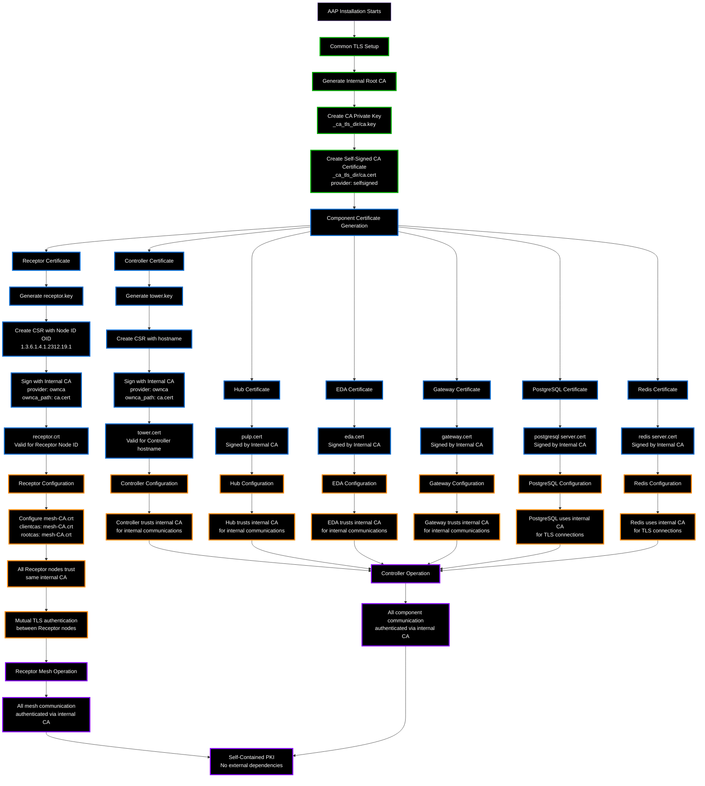

# Receptor Internal CA and Self-Signing Process

## How AAP Installer Creates Internal PKI

## Key Points

### Internal CA Design
1. **Single Root CA** signs all component certificates
2. **Self-contained PKI** - no external dependencies
3. **Consistent trust model** across all AAP components

### Certificate Characteristics
- **Receptor certificates** include Node ID OIDs for mesh authentication
- **Component certificates** include hostnames/SANs for service authentication
- **All certificates signed by same internal CA** for unified trust

### Why This Works
- **Mutual trust** - all components trust the same root CA
- **Secure communication** - proper TLS encryption and authentication
- **No external dependencies** - works in isolated environments
- **Compliance ready** - proper certificate hierarchy

### The Problem
When `custom_ca_cert` is provided, installer concatenates it with internal CA in `mesh-CA.crt`, creating unnecessary bloat for Receptor mesh authentication that only needs the internal CA.

### The Solution
Keep internal CA separate for Receptor mesh, use custom CAs only where actually needed (system trust store, external integrations).
