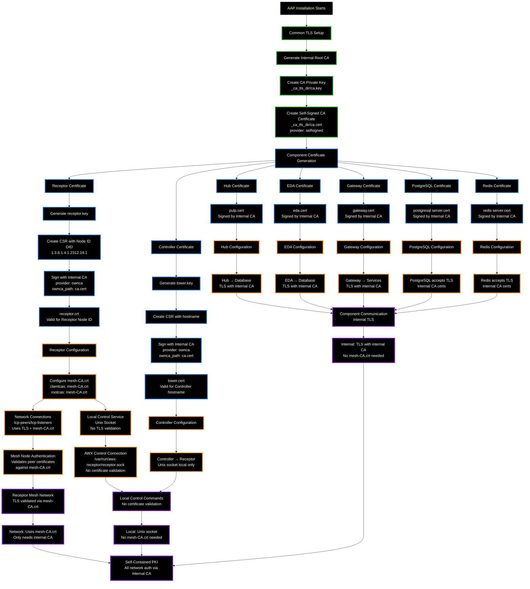

# Receptor Internal CA and Self-Signing Process

## How AAP Installer Creates Internal PKI

## Key Points

### Internal CA Design
1. **Single Root CA** signs all component certificates
   - **Code:** `aap-containerized-installer/roles/common/tasks/tls.yml` (provider: selfsigned)
2. **Self-contained PKI** - no external dependencies
   - **Code:** All components use `provider: ownca` with same internal CA
3. **Consistent trust model** across all AAP components

### Connection Types and Certificate Validation

#### **Network Connections (TLS Validated):**
- **Receptor mesh** (node-to-node): Uses tcp-peers/tcp-listeners with TLS
- **Validates certificates** against mesh-CA.crt during QUIC handshakes
- **Code:** `receptor/pkg/netceptor/tlsconfig.go` lines 208-217 (RootCAs), 125-132 (ClientCAs)
- **All mesh nodes** present certificates signed by internal CA
- **Only internal CA needed** in mesh-CA.crt for validation

#### **Unix Socket Connections (No TLS):**
- **AWX → Receptor** control service: `/var/run/awx-receptor/receptor.sock`
- **Code:** `awx/awx/main/tasks/receptor.py` line 165, `receptorctl/socket_interface.py` lines 96-104
- **Local process communication** (no network layer)
- **No certificate validation** occurs (Unix sockets don't use TLS)
- **mesh-CA.crt not used** for local control service connections

#### **Internal Component Connections (TLS with Internal CA):**
- **Database connections:** TLS enabled (`sslmode: require`) but uses internal CA certs
- **Code:** `awx/tools/docker-compose/ansible/roles/sources/templates/database.py.j2`
- **Gateway Redis:** Separate `redis_ca.cert` file, not mesh-CA.crt
- **Code:** `aap-gateway/aap_gateway_api/defaults.py` lines 58-62
- **No mesh-CA.crt involvement** - separate from Receptor mesh

### Certificate Characteristics
- **Receptor certificates** include Node ID OIDs (1.3.6.1.4.1.2312.19.1) for mesh authentication
- **Component certificates** include hostnames/SANs for service authentication
- **All certificates signed by same internal CA** for unified trust

### Why This Works
- **Mutual trust** - all components trust the same root CA
- **Secure communication** - proper TLS encryption and authentication
- **No external dependencies** - works in isolated environments
- **Proper separation** - Unix sockets for local, TLS for network

### The Problem
**Code:** `aap-containerized-installer/roles/receptor/templates/mesh-CA.crt.j2`

When `custom_ca_cert` is provided, installer concatenates it with internal CA in `mesh-CA.crt`, creating unnecessary bloat. Since:
- **All mesh nodes** use internal CA-signed certificates (installer generates these)
- **Local connections** don't validate mesh-CA.crt (Unix sockets - no TLS)
- **Only network mesh connections** use mesh-CA.crt for validation
- **Custom CAs provide no value** for Receptor mesh authentication

**Evidence:** KCS 7129200 workaround (keep only first certificate) works without functionality loss.

### The Solution
**Template change:** `aap-containerized-installer/roles/receptor/templates/mesh-CA.crt.j2`

Remove custom CA concatenation - Receptor mesh only needs internal CA for node authentication. Custom CAs remain available in system trust store (`/etc/pki/ca-trust/source/anchors/`) for external integrations.

**Code reference:** `automation-platform-collection/roles/certificate_authority/tasks/add_cacert.yml` (system trust installation)
